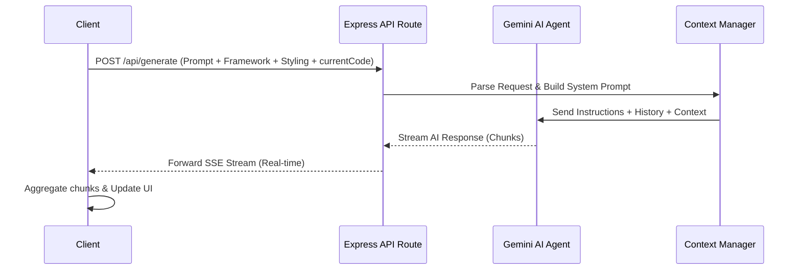

# AI Code Generator Backend

This is the backend server for the AI Code Generator. It provides an Express-based API that interfaces with the Gemini AI model to generate, stream, and refine React code based on user prompts.

## API Description

### `POST /api/generate`
This is the core endpoint responsible for processing user prompts and streaming AI-generated code back to the client.

**Request Body:**
```json
{
  "prompt": "Create a sleek login form using Tailwind.",
  "framework": "react",
  "styling": "tailwind",
  "currentCode": "// Optional: The current code state to provide context for modifications"
}
```

**Response:**
Server-Sent Events (SSE) stream containing the incremental generation of the code string.

### `GET /api/health`
Endpoint to verify the health and status of the backend server. Returns a basic status object.

## How the Agent Works

The backend utilizes an intelligent agent approach to handle code generation, ensuring that the AI maintains context and produces robust code.

### Agent Workflow Diagram



### Agent Features
- **Context Awareness**: The agent is fed the `currentCode` if available, allowing it to apply incremental modifications rather than rewriting from scratch.
- **System Prompting**: Strong system instructions guide the agent to output ONLY valid React/Tailwind code without unnecessary markdown or conversational filler.
- **Streaming Execution**: The agent's output is piped directly through an SSE stream to minimize perceived latency, giving the user immediate visual feedback.
