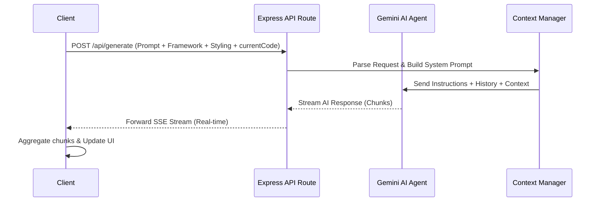

# AI Code Generator Backend

## What is it?
This is the backend server for the **AI Code Generator (Codegen)**. It is a robust, Express-based Node.js API that acts as the bridge between the frontend client and the AI models (like Gemini).

## What does it do?
It handles user requests to generate code, manages the context of the conversation (so you can ask the AI to modify existing code), and securely communicates with the AI APIs. Instead of waiting for the entire code block to be generated, it streams the AI's response back to the client in real-time, significantly reducing perceived latency.

## How does it do it?
1. **Request Handling:** It exposes a `POST /api/generate` endpoint that receives the user's natural language prompt, chosen framework, styling preferences, and any existing code context.
2. **System Prompting:** It wraps the user's prompt with strict system instructions, ensuring the AI strictly returns valid React/Tailwind code without any conversational filler.
3. **AI Streaming:** It connects to the Gemini AI API, receives the response as a stream of text chunks, and immediately forwards those chunks to the frontend using Server-Sent Events (SSE).

---

## API Description

### `POST /api/generate`
This is the core endpoint responsible for processing user prompts and streaming AI-generated code back to the client.

**Request Body:**
```json
{
  "prompt": "Create a sleek login form using Tailwind.",
  "framework": "react",
  "styling": "tailwind",
  "currentCode": "// Optional: The current code state to provide context for modifications"
}
```

**Response:**
Server-Sent Events (SSE) stream containing the incremental generation of the code string.

### `GET /api/health`
Endpoint to verify the health and status of the backend server. Returns a basic status object.

## How the Agent Works

The backend utilizes an intelligent agent approach to handle code generation, ensuring that the AI maintains context and produces robust code.

### Agent Workflow Diagram



### Agent Features
- **Context Awareness**: The agent is fed the `currentCode` if available, allowing it to apply incremental modifications rather than rewriting from scratch.
- **System Prompting**: Strong system instructions guide the agent to output ONLY valid React/Tailwind code without unnecessary markdown or conversational filler.
- **Streaming Execution**: The agent's output is piped directly through an SSE stream to minimize perceived latency, giving the user immediate visual feedback.
